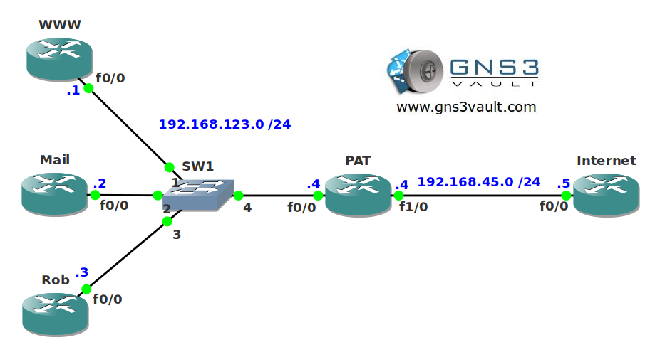

# Static PAT (Port Forwarding)

## Scenario

You are a trainee for a large international website covering a wide range of topics on automobiles. You are using NAT and PAT for connectivity to the Internet but you also have a number of hosts on your internal network. You need to make sure that the Webserver and Mailserver are reachable from the Internet.

## Goal

- All IP addresses have been preconfigured for you.
- Configure router PAT so all internal devices are able to reach the Internet.
- Configure router PAT so the Web- and Mailserver are reachable from the Internet.
- Ensure router Internet doesn't know about the 192.168.123.0 /24 network.

## IOS

c3640-jk9o3s-mz.124-16.bin

## Topology

## Video Solution

[Video Solution on YouTube](http://www.youtube.com/watch?v=bptbBNdWCrY)
