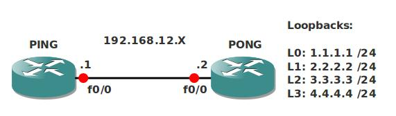

# TCLSH Scripting

## Scenario

To make your life easier you decided to practice some TCLSH scripting skills, this will ensure it takes less time to ping.

## Goal

* All IP addresses are preconfigured as specified in the topology picture.
* Ensure you can ping the loopbacks on PONG from router PING.
* Create a TCLSH script that pings all the loopback ip addresses at once.

## IOS

c3640-jk9s-mz.124-16.bin

## Topology

## Video Solution

http://www.youtube.com/watch?v=awyT_1j8Zx8
