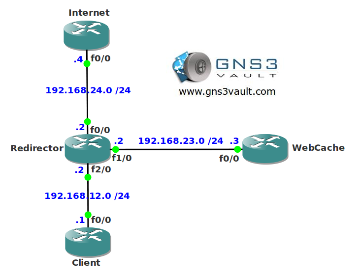

# Web Cache Communication Protocol (WCCP) V1

## Scenario

Many users on your network are using the Internet but the connection you have from the ISP is quite expensive. You want to get the most out of your connection and ensure users don't load pages from the Internet that have been loaded previously. You decide to implement a web cache server using WCCP v1. Let's see if you can configure the router to support this.

## Goal

- All IP addresses have been preconfigured for you.
- Router "webcache" is a fictional web cache server, we can still practice the commands needed for WCCPv1 with this lab.
- Configure router "redirector" so it redirects packet for web caching to router "webcache".
- Configure a loopback0 interface on router "client" with IP address 1.1.1.1 /24.
- Configure router "redirector" so it excludes redirection from network 1.1.1.0 /24.

## IOS

c3640-jk9s-mz.124-16.bin

## Topology

## Video Solution

http://www.youtube.com/watch?v=4_xEqrSGj2A
