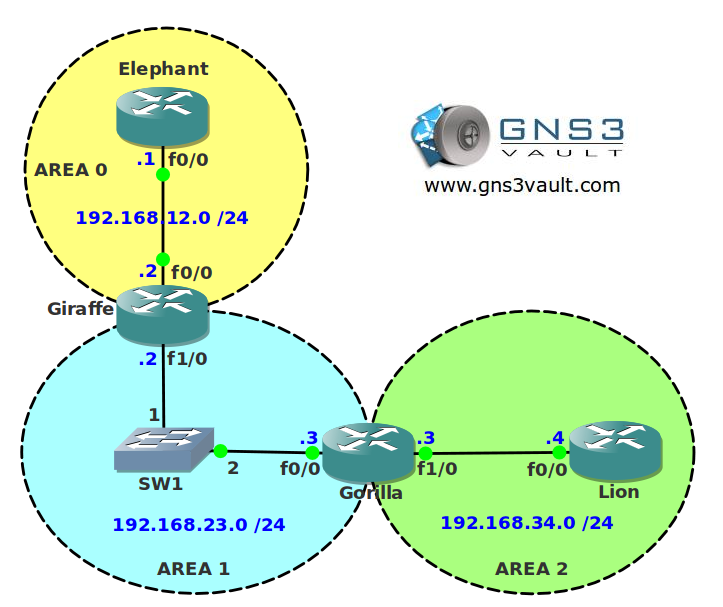

# OSPF Authentication

## Scenario:

The local zoo needs your help with their OSPF network. Since a recent animal breakout the security department decides all routing protocols need authentication. You decide to implement OSPF authentication in any way you can.

## Goal:

- All IP addresses have been preconfigured for you.
- Configure OSPF on all routers. Achieve full connectivity. Ensure area 2 is directly connected by using a virtual link.
- Configure MD5 authentication for Area 0. Do not use any interface commands to activate it.
- Configure plaintext authentication in Area 1. Use interface commands to achieve this.
- Configure MD5 authentication for the virtual link.

## Additional Information:

## IOS:

- c3640-jk9s-mz.124-16.bin

## Topology:

## Video Solution:

- [YouTube Video](http://www.youtube.com/watch?v=awytpQIOGCk)
