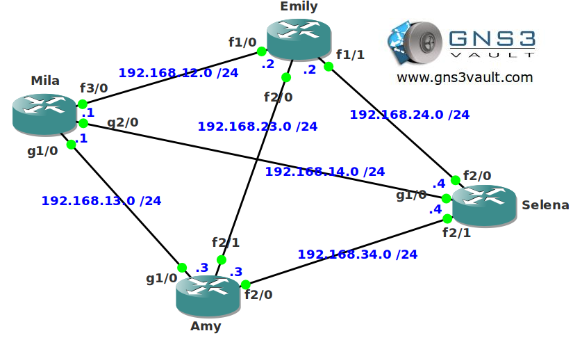

# OSPF Auto Cost Reference Bandwidth

## Scenario

The new muppet movie is almost finished. All the actresses prefer to have a dedicated internet connection in their trailers at the movie park. You configure a couple of routers with Gigabit and FastEthernet interfaces. Unfortunately OSPF doesn't seem to make a difference between FastEthernet and Gigabit links. It's up to you to make the changes so it does see a difference...

## Goal

- All IP addresses have been preconfigured for you.
- Configure OSPF on all routers. Achieve full connectivity.
- Without changing the OSPF cost on each interface, ensure OSPF will make the best use of the Gigabit interfaces. In the future you will also add some ten Gigabit links so this is something to be aware of.

## IOS

- c7200-adventerprisek9-mz.124-20.T.bin

## Topology

## Video Solution

[Video Solution on YouTube](http://www.youtube.com/watch?v=zN_z1DeJBP0)
