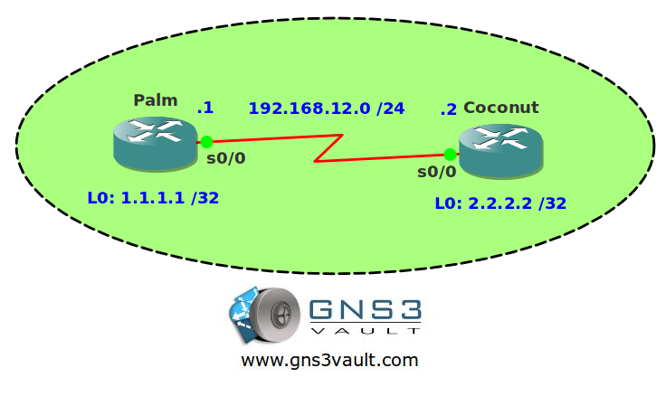

# OSPF Demand Circuit

## Scenario

Living on a tropical island isn't all that bad. You run a small network used to order cocktails at the Coconut Bar so they are delivered at Palm beach. Unfortunately the links you are using are leased line and pretty expensive. You need to make sure you don't send any unnecessary OSPF traffic or you won't be able to afford any more sunscreen.

## Goal

- All IP addresses have been preconfigured for you.
- Configure OSPF on both routers. Achieve full connectivity.
- Ensure no periodic hello packets are sent on the serial interfaces without breaking the OSPF neighbor adjacency.

## IOS

c3640-jk9s-mz.124-16.bin

## Topology

## Video Solution

http://www.youtube.com/watch?v=iqTVtgjI8Us
