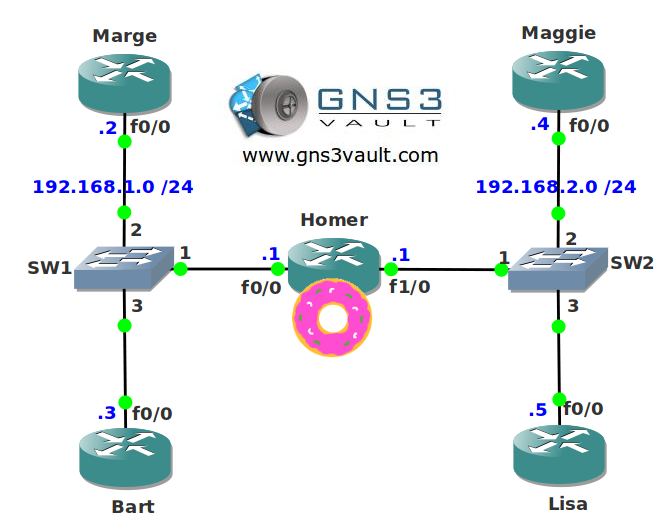

# OSPF DR BDR Election

## Scenario:

You end up working as one of the network engineers for a nuclear powerplant located in a cartoony looking town. OSPF is being used as the IGP routing protocol but there have been some problems with the network. It is uncertain which router is being chosen as the designated or backup designated router. Up to you to fix these issues!

## Goal:

- All IP addresses have been preconfigured for you as specified in the topology picture.
- Configure OSPF on all routers, achieve full connectivity.
- Ensure router Marge is the DR for network 192.168.1.0 /24.
- Ensure router Bart is the BDR for network 192.168.1.0 /24.
- Ensure router Home is the DR for network 192.168.2.0 /24. You are not allowed to change the priority.
- Ensure router Maggie is the BDR for network 192.168.2.0 /24. You are not allowed to change the priority.

## IOS:

c3640-jk9s-mz.124-16.bin

## Topology:

## Video Solution:

[OSPF DR BDR Election Video](http://www.youtube.com/watch?v=E1sNeikHniQ)
