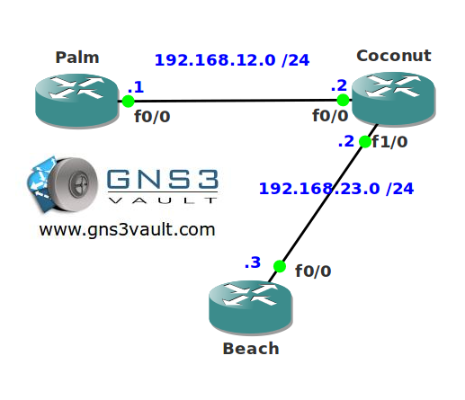

# OSPF Flood Reduction

## Scenario:

You live on a tropical island and work as a network engineer and scientist. After years of study you have discovered a formula so you do not age anymore. Unfortunately your network is running OSPF and LSAs still age...you are wondering if you can do something to OSPF as well.

## Goal:

* All IP addresses have been preconfigured for you.
* Configure OSPF on all routers. Achieve both connectivity.
* Configure OSPF so there is no longer a periodic refresh of LSAs.

## IOS:

c3640-jk9s-mz.124-16.bin

## Topology:

## Video Solution:

http://www.youtube.com/watch?v=11kwf88nco4
