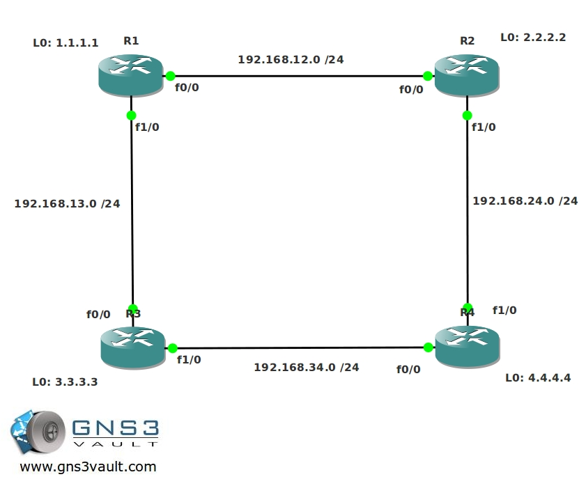

# OSPF Intermediate

## Scenario

As a network engineer you are familiar with the concepts of OSPF and single-area implementations, however you never tried to create a multi-area ospf configuration. You have heard about different area types like stubby, not so stubby but never encountered them in real life. You boot up your good old routers and prepare for the lab to change this once and for all.

## Goal

- All IP addresses have been preconfigured for you.
- Configure OSPF on all routers, achieve full connectivity. Make sure you can ping any IP Address from all routers. All networks should be in Area 0.
- Manually set the Router-ID of R1 to 1.1.1.2, make sure if you look at R2 or R3 that you really see the new router ID.
- Change OSPF so R3 becomes the designated router on the 192.168.34.X segment.
- Change the metric on the link between R1 and R2, do not use the ip ospf cost command for this.
- Change the reference bandwidth on all routers to 1500.
- Enable cleartext authentication between R2 and R4.
- Enable MD5 authentication between R3 and R4.
- On the link between R2 and R4, change the hello timer to 10 seconds and the dead-interval to 60 seconds.
- Insert a default route on R4 so that you see a 0.0.0.0/0 route in the routing table of R1, R2 and R3.
- Shutdown the link between R2 and R4.
- The link between R1 and R2, and R2's loopback interface should be configured as area 1.
- Configure area 1 as a not so stubby area (nssa).
- Configure R4's loopback0 interface as area 2.
- Create 4 loopbacks on R4:
  - Loopback10: 172.16.0.1 /24
  - Loopback11: 172.16.1.1 /24
  - Loopback12: 172.16.2.1 /24
  - Loopback13: 172.16.3.1 /24
- Advertise these networks in OSPF area 2 but make sure you only see a single entry (172.16.0.0 /22) in the routing table of R1, R2 and R3.
- Create another loopback on R4:
  - Loopback14: 172.16.4.1 /24
- You are not allowed to advertise this loopback in OSPF or by using redistribution. Ensure other routers can reach this loopback.

## IOS

- **Image**: c3640-jk9s-mz.124-16.bin

## Topology

## Video Solution

- http://www.youtube.com/watch?v=C2uc8qEacOM
- http://www.youtube.com/watch?v=cb5ai2zldug
