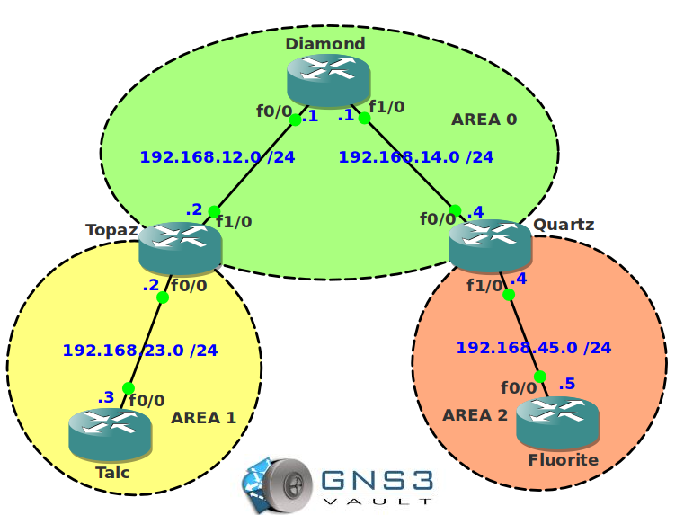

# OSPF LSA Type 3 summarization

## Scenario

The mineral express is specialized in trading expensive minerals. You are their senior network engineer and responsible for the OSPF network that they have running. One of your colleagues is complaining that the routing table is becoming too large. It's up to you to configure some summarization!

## Goal

- All IP addresses have been preconfigured for you.
- Configure OSPF on all routers. Achieve full connectivity.
- Router Talc and Fluorite have multiple loopback interfaces. Configure the network so Area 0 only sees a summary of these networks. Use the most optimal summary.

## About This Lab

## IOS

- **Image:** c3640-jk9s-mz.124-16.bin

## Topology

## Video Solution

[OSPF LSA Type 3 Summarization Lab Solution](http://www.youtube.com/watch?v=WMknpsFqtOM)
