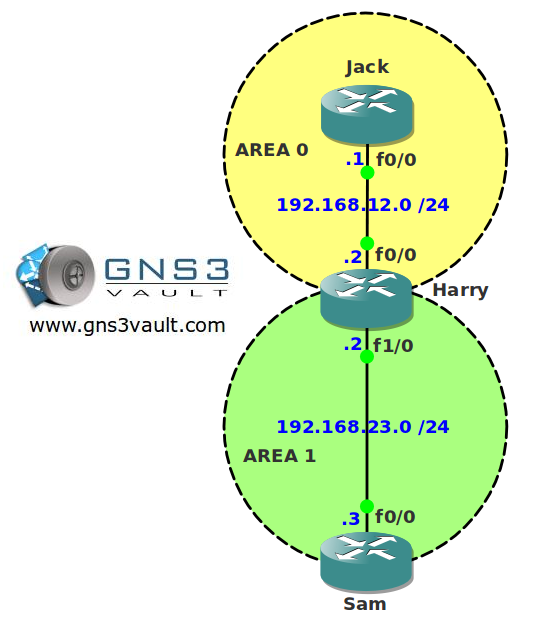

# OSPF LSA Type 5 summarization

## Scenario

As the junior network engineer for a large cartoon network you are asked to look at the OSPF configuration of the network. Some external networks are redistributed into OSPF and your boss asks you if you can summarize them so the routing table stays small. Your colleague tried some summary commands but couldn't get it working...see if you can fix it!

## Goal

- All IP addresses have been preconfigured for you.
- Configure OSPF on all routers. Advertise all physical interfaces.
- Router Sam has a number of loopback interfaces. Redistribute them in OSPF so they show up as external routes on router Jack.
- Configure OSPF so there are two summaries for the loopback interfaces of router Sam. Use the most optimal summaries.

## IOS

c3640-jk9s-mz.124-16.bin

## Topology

## Video Solution

[Video Solution on YouTube](http://www.youtube.com/watch?v=4c-YooOgQPM)
