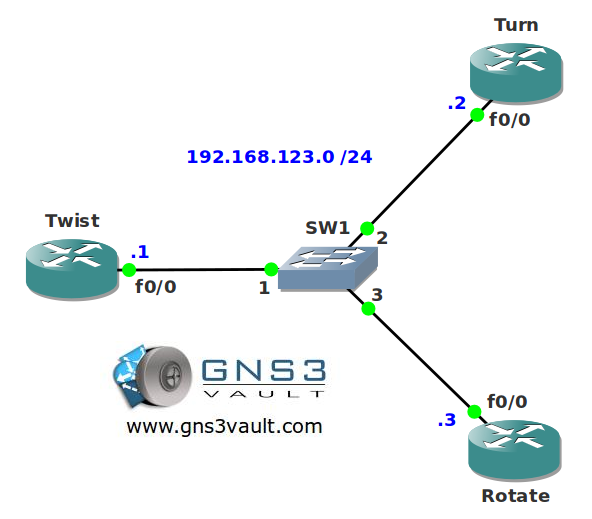

# OSPF MD5 Authentication Rotating Key

## Scenario

You work for the government as a contracted network engineer. They want you to improve their OSPF security. Instead of using a single key for all routers they want to ensure each OSPF neighbor adjacency has a different key. Let's find out if you can lock this one down.

## Goal

- All IP addresses have been preconfigured for you.
- Configure OSPF on all routers. Achieve full connectivity.
- Router Twist and Turn have to use password "PASSWORD".
- Router Twist and Rotate have to use password "VAULT".

## IOS

c3640-jk9s-mz.124-16.bin

## Topology

## Video Solution

http://www.youtube.com/watch?v=4Mi2ZxrKgbQ
