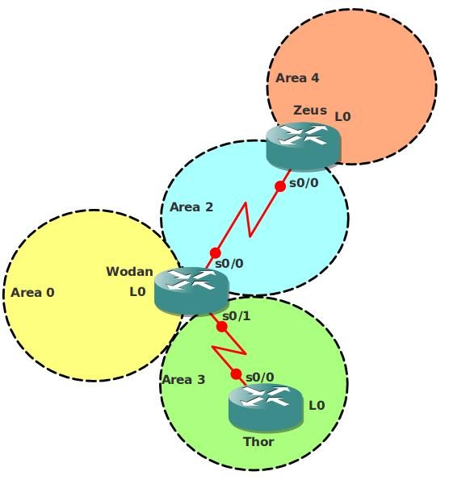

# OSPF NSSA (Not so stubby area)

## Scenario

You are the network engineer for a new service provider called "Mythical Bits". The routing protocol for the backbone of the network will be OSPF. To reduce the size of routing tables the company decided they want to create a design with different OSPF types like the "NSSA".

## Goal

- All IP addresses have been preconfigured for you, every router has a loopback interface:
  - Router Wodan: L0: 1.1.1.1 /24
  - Router Zeus: L0: 2.2.2.2 /24
  - Router Thor: L0: 3.3.3.3 /24

- Configure OSPF on all routers, configure the areas as specified in the topology picture.
- Router Wodan: Loopback0 should be Area 0.
- Router Zeus: Loopback0 should be Area 4.
- Area 4 has no direct connection to Area 0, solve this by using OSPF commands.
- Ensure you have full reachability.
- Configure Area 3 into a NSSA (Not so stubby area).

- Router Thor: add the following loopbacks:
  - Loopback1: 172.16.0.3 /24
  - Loopback2: 172.16.1.3 /24

- Advertise these networks into OSPF, do not use the "network" command to achieve this!
- Router Thor: configure a summary towards Area 0 for the 2 loopbacks you just created, make sure you do not advertise networks you do not have.

- Router Zeus: add the following loopbacks:
  - Loopback1: 172.16.2.2 /24
  - Loopback2: 172.16.3.2 /24

- Router Zeus: configure a summary towards Area 0 for the 2 loopbacks you just created, make sure you do not advertise networks you do not have.
- When you look in the routing table of Router Wodan you see some of the loopbacks advertised as /32's. Make sure you see the correct subnet mask that has been configured.

## IOS

c3640-jk9s-mz.124-16.bin

## Topology

## Video Solution

http://www.youtube.com/watch?v=byptcizL3lM
