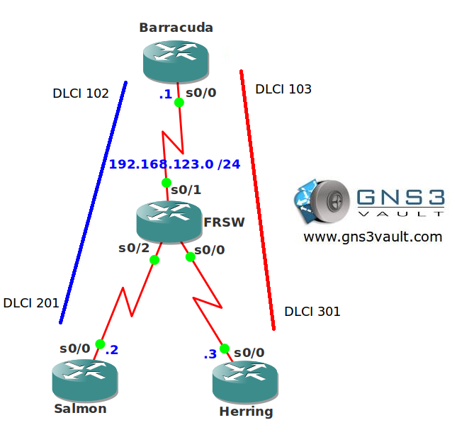

---
title: "OSPF per Neighbor Cost"
slug: "ospf-per-neighbor-cost"
category: "OSPF"
wordpress_id: 848
---

## Scenario

The local fish trading market needs your help with their OSPF network. It seems their routers are unable to change the bandwidth or cost on the interfaces so you need to use another solution to influence OSPF routing...sounds fishy!

## Goal

* All IP addresses have been preconfigured for you.
* Configure OSPF on all routers. Achieve full connectivity.
* Configure a loopback0 interface with IP address 1.1.1.1 /32 on router Salmon and Herring.
* Advertise the loopback0 interface on router Salmon and Herring.
* Configure your network so router Barracuda sends all traffic for 1.1.1.1 /32 to router Herring. You are not allowed to change the bandwidth or cost on the interface.

## Motivation

## IOS

c3640-jk9s-mz.124-16.bin

## Topology

## Video Solution

[OSPF per Neighbor Cost Video Solution](http://www.youtube.com/watch?v=M33oKPT6oh8)
