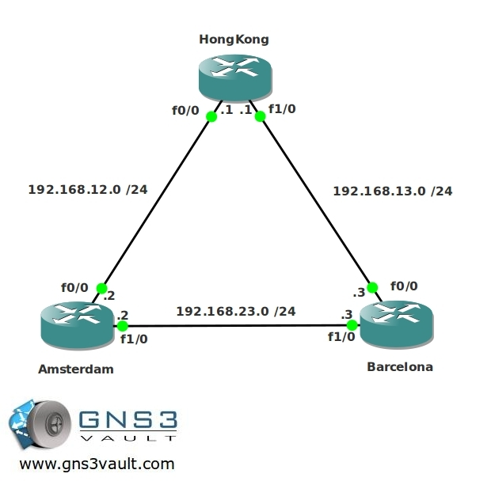

# OSPF Single Area

## Scenario

AsianFish inc. is expanding their business towards Europe so they need to expand their network as well. You are responsible for the performance of the network and decided that OSPF would be a suitable candidate for a routing protocol. Because the network at this moment is still small, you decided a single area OSPF should be enough. It's up to you to make it work!

## Goal

* All IP addresses have been preconfigured for you.
* The following loopback interfaces have been configured:
  - HongKong: 1.1.1.1 /24
  - Amsterdam: 2.2.2.2 /24
  - Barcelona: 3.3.3.3 /24
* HongKong: Configure OSPF (process-id 1) and advertise all networks by using a single network statement. Use area0
* Amsterdam: Configure OSPF (process-id 1) and advertise all networks by using 2 network statements, area0.
* Barcelona: Configure OSPF (process-id 1) and advertise all networks by using 3 network statements, area0.
* Optional: the loopback interfaces appear as /32's in the routing table, make sure they appear as /24's just as you configured them.
* Amsterdam: change the router-id to 22.22.22.22, make sure you see this change from Barcelona by using show commands.
* Traffic from Barcelona to HongKong should use the link between Amsterdam-Barcelona, use the cost command to achieve this.
* Remove the previous change with the cost-command, achieve the same goal by using the bandwidth command.
* Enable clear-text authentication between Amsterdam and HongKong. Use "vault" as a password.
* Enable MD5 authentication between Barcelona and HongKong. Use "Safe" as a password.
* Change the OSPF timers on the link between Amsterdam and Barcelona so hello packets are being sent every 5 seconds.
* The HongKong router will have access to the Internet in the future, you need to advertise a default route in OSPF so Amsterdam and Barcelona will send traffic for unknown networks to HongKong.

## IOS

c3640-jk9s-mz.124-16.bin

## Topology

## Video Solution

http://www.youtube.com/watch?v=ugAqUqZdGkM
