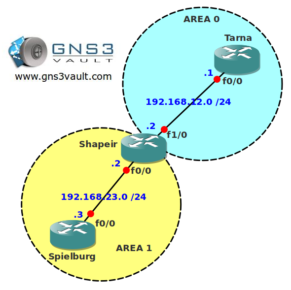

# OSPF Summarization Discard Route

## Scenario

Ever since you encountered a router your quest has been to become a successful network engineer. Your career is prosperous and there isn't a bit that you haven't slain before. This time however you are running into trouble with one of your OSPF routers. It seems one of your routers is installing a null0 route whenever you do summarization and this is something you don't want to happen...

## Goal

- All IP addresses have been preconfigured for you.
- Configure OSPF and use the correct areas.
- Configure a loopback0 interface on router Spielburg with network address 3.3.3.3 /24.
- Configure router Shapeir to summarize network 3.3.3.0 /24 to 3.0.0.0 /8.
- Configure router Shapeir so it doesn't add a null0 entry in its routing table.

## IOS

c3640-jk9s-mz.124-16.bin

## Topology

## Video Solution

[Video: OSPF Summarization Discard Route Solution](http://www.youtube.com/watch?v=kBMf5oF_tzM)
