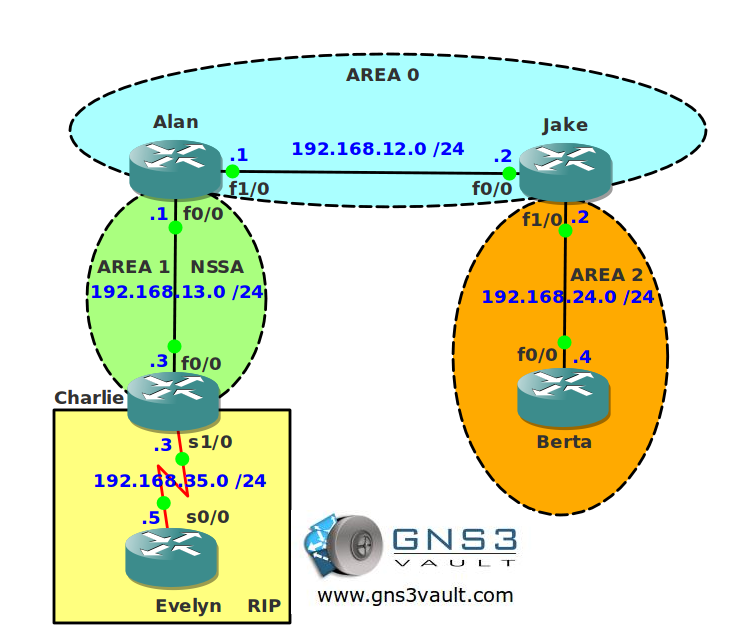

# OSPF Suppress Forward Address

## Scenario:

You are the senior network engineer for a company that runs the show "Two and a half Router". To increase OSPF performance your colleague has implemented a NSSA area and some prefix filters. Strangely enough you now have problems with reachability. Let's see what you can do about it.

## Goal:

- All IP addresses have been preconfigured for you.
- Configure OSPF and use the correct areas. Ensure Area 1 is a NSSA.
- Configure RIP between router Charlie and Evelyn.
- Create a loopback0 interface on router Evelyn with IP address 1.1.1.1 /24 and advertise it in RIP.
- Redistribute between RIP and OSPF.
- Configure a prefix-list on router Jake which filters network 192.168.13.0 /24.
- Ensure you can still reach network 1.1.1.0 /24 from all routers without removing the prefix-list. You are only allowed to use OSPF commands.

## IOS:

c3640-jk9s-mz.124-16.bin

## Topology:
