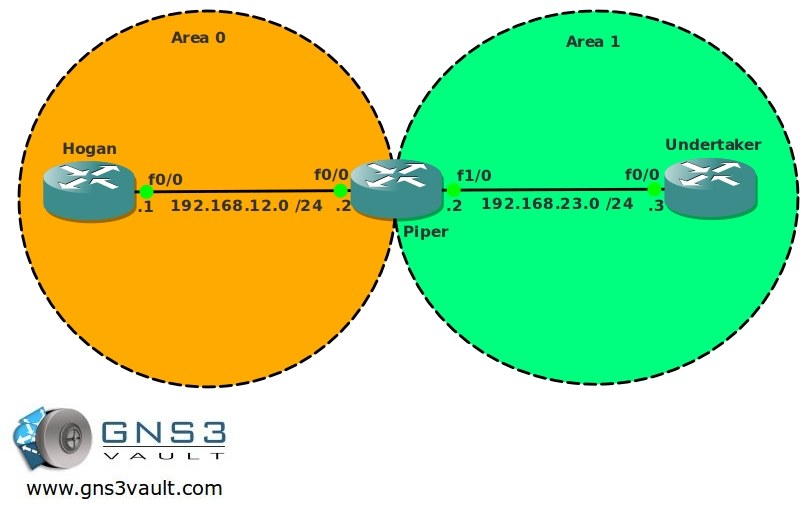

# OSPF Totally NSSA

## Scenario

You are working for a well-known wrestling federation and after countless battles you decided to switch your career and become a network engineer. The federation is using network equipment that is still from the 80's, therefore you need to make sure the routing tables will be as small as possible to guarantee good performance...get ready to rumble!

## Goal

- All IP addresses have been preconfigured for you.
- Configure OSPF on all routers, use the Area's as specified in the topology picture.
- Achieve full connectivity.
- Router Hogan: create additional loopbacks:
  - L1: 172.16.0.1 /24
  - L2: 172.16.1.1 /24
  - L3: 172.16.2.1 /24
  - L4: 172.16.3.1 /24
- Redistribute these networks into OSPF Area 0. Do not use the "network" command to achieve this.
- Take a look at the routing table of Router Undertaker, you should see all 4 networks. Make sure you can ping them.
- Change the area type of Area 1 so you don't see the 4 networks anymore but only 1 default route.
- Make sure you can still ping the 4 networks.
- Router Hogan: create additional loopbacks:
  - L4: 172.16.4.1 /24
  - L5: 172.16.5.1 /24
  - L6: 172.16.6.1 /24
  - L7: 172.16.7.1 /24
- Advertise these 4 networks into OSPF Area 0 by using the network command.
- Take a look at Router Undertaker, you should see all 4 networks.
- Change the area type of Area 1 so you don't see these 4 networks anymore but only a default route.
- Router Undertaker: create a loopback interface:
  - L0: 2.2.2.2 /24
- Configure RIP version 2 and advertise the 2.2.2.0 network into RIP.
- Router Undertaker: Redistribute RIP into OSPF, you are not allowed to turn Area 1 back into a standard Area.
- Make sure you still meet all the previous requirements.
- Make sure you can ping the 2.2.2.0 network from Router Hogan.
- Router Undertaker should only have a default route pointing to the Loopbacks of Router Hogan.

## Additional Content

## IOS

c3640-jk9s-mz.124-16.bin

## Topology

## Video Solution

[OSPF Totally NSSA - Video Solution](http://www.youtube.com/watch?v=KHY-Mk6cpL0)
