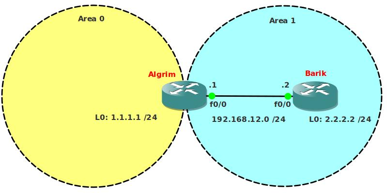

# OSPF Totally Stub

## Scenario:

This lab is a follow-up of the OSPF Stub lab. I'd recommend you configure that lab before this one. The company specialized in selling Fantasy E-books is becoming more popular everyday and after your trainee period they decided to offer you a job. They still don't have any money to upgrade their network equipment and they are still experiencing problems with big routing tables... time to tune OSPF some more!

## Goal:

- All IP addresses have been preconfigured for you.
- Configure OSPF on both routers, use the Area's as specified in the topology picture.
- Router Algrim: Loopback0 should be in Area0
- Achieve full connectivity.
- Router Algrim: create additional loopbacks:
  - L1: 172.16.0.1 /24
  - L2: 172.16.1.1 /24
  - L3: 172.16.2.1 /24
  - L4: 172.16.3.1 /24
- Advertise these networks into OSPF Area 0.
- Take a look at the routing table of Router Barik, you should see all 4 networks. Make sure you can ping them.
- Change the area type of Area 1 so you don't see the 4 networks anymore but only 1 default route.
- Make sure you can still ping the 4 networks.

## IOS:

c3640-jk9s-mz.124-16.bin

## Topology:

## Video Solution:

[Video Solution on YouTube](http://www.youtube.com/watch?v=KgRmxG5qXK4)
