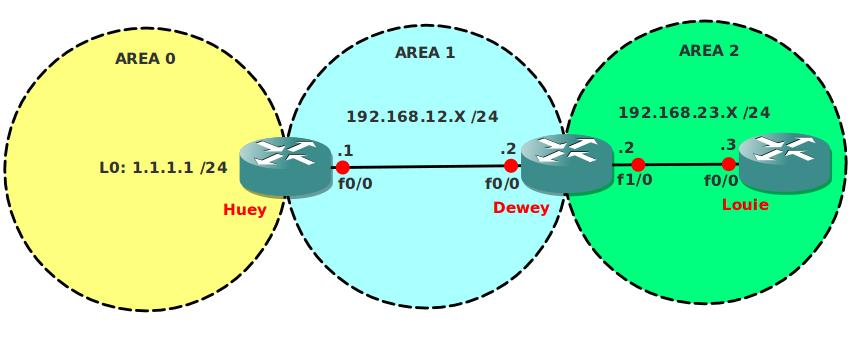

# OSPF Virtual Link and Summarization

## Scenario

The Company you are currently working for has recently bought a smaller organization and now needs to connect the 2 networks together. Company policy specifies that only OSPF can be used as a routing protocol and it's physically impossible to connect the Louie router to the Huey router. Up to you to find a good solution...!

## Goal

- All IP addresses have been preconfigured for you.
- Configure OSPF on all routers, configure the areas as specified in the topology picture.
- Area 2 has no direct connection to Area 0, solve this by using OSPF commands.
- Ensure you have full reachability.
- Create some extra loopbacks on router Louie and advertise them in area 2:
  - Loopback0: 172.16.0.1 /24
  - Loopback1: 172.16.1.1 /24
  - Loopback2: 172.16.2.1 /24
  - Loopback3: 172.16.3.1 /24
- Make sure router Huey only sees 172.16.0.0/22 in it's routing table, you are only allowed to make changes to router Dewey.

## Key Concepts

This lab covers:
- OSPF Virtual Links
- Route Summarization
- OSPF Area Design
- Multi-area OSPF Configuration

## IOS Version

- c3640-jk9s-mz.124-16.bin

## Topology

## Video Solution

- [YouTube: OSPF Virtual Link and Summarization](http://www.youtube.com/watch?v=36FyRk5fmkI)
