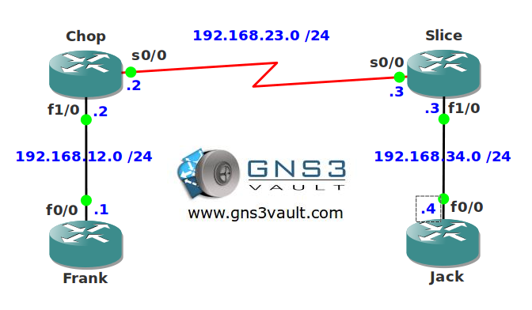

# Link fragmentation and Interleaving for Multilink PPP

## Scenario

Your VoIP network is a little problematic to say the least. VoIP calls sound choppy and users are complaining all over the place. You look into the datastreams and it seems large data frames are preventing VoIP packets to get to their destination in time. You can't upgrade the links but you have read about link fragmentation and interleaving...let's chop em down!

## Goal

* All IP addresses have been preconfigured for you.
* Configure PPP encapsulation between router Chop and Slice.
* Configure PPP Multilink between router Chop and Slice.
* Configure fragmentation and interleaving on router Chop and Slice.
* The serialization delay should have a maximum of 10ms. The bandwidth of the serial link is 64kbps.

## IOS

c3640-jk9s-mz.124-16.bin

## Topology

## Video Solution

[Link Fragmentation and Interleaving for Multilink PPP - Video Solution](http://www.youtube.com/watch?v=dohclmbeY0M)
