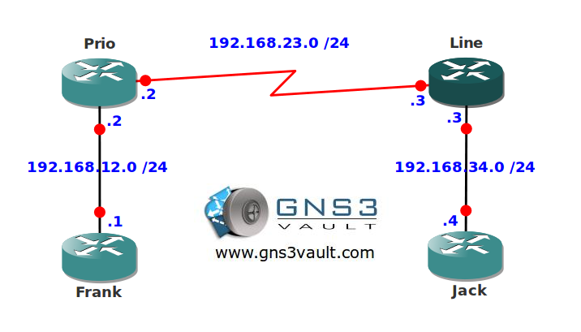

# MQC Class-Based Weighted Fair Queueing

## Scenario

As the senior network engineer you are always looking for methods to improve your network. To ensure all traffic in your network has a fair share of bandwidth you decide to implement class based weighted fair queueing.

## Goal

* All IP addresses have been preconfigured for you.
* The serial link between router Prio and Line has a bandwidth of 128Kbps.
* Configure an outbound policy on router Prio with the following configuration:
* HTTP traffic should get a bandwidth of 16Kbps and the queue should have a maximum of 12 packets.
* RTP traffic should get a bandwidth of 96Kbps and the queue should have a maximum of 32 packets.

## IOS

c3640-jk9s-mz.124-16.bin

## Topology

## Video Solution

[MQC Class-Based Weighted Fair Queueing Video](http://www.youtube.com/watch?v=7NR19nBw24g)
