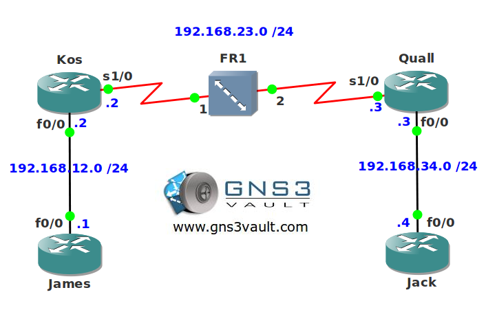

# MQC Frame-Relay Traffic Shaping

## Scenario

As one of the network engineers for a large frame-relay provider in the US you are asked by your boss to configure QoS. He wants you to get in shape by configuring traffic shaping for frame-relay. You are familiar with the old legacy solution but you need to use MQC for this one.

## Goal

- All IP addresses have been preconfigured for you.
- Configure router Kos so all traffic passing the frame-relay link has a CIR of 64Kbps.
- You are not allowed to enable frame-relay shaping on the physical interface.

## IOS

c3640-jk9s-mz.124-16.bin

## Topology

## Video Solution

[Video Solution on YouTube](http://www.youtube.com/watch?v=QP0z4x4GSrU)
