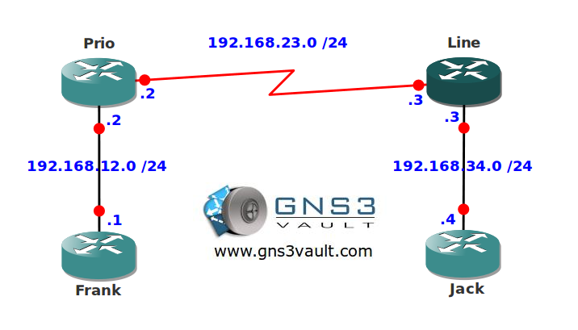

# MQC Low Latency Queueing

## Scenario

You are the VoIP specialist at the ISP you are working for. To ensure all VoIP traffic has enough bandwidth and low delay you have to implement some Quality of Service settings. It's time to classify and mark some traffic!

## Goal

* All IP addresses have been preconfigured for you.
* The serial link between router Prio and Line has a bandwidth of 128Kbps.
* Configure an outbound policy on router Line with the following configuration:
* RTP traffic should have a priority queue which is 10 percent of the bandwidth.
* TELNET traffic should get a remaining bandwidth of 25 percent of the bandwidth.

## IOS

c3640-jk9s-mz.124-16.bin

## Topology

## Video Solution

[Video Solution - YouTube](http://www.youtube.com/watch?v=if-AXPCiNxk)
