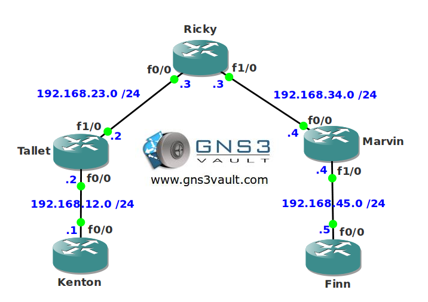

# MQC Qos Pre-Classify

## Scenario

You work for a Dutch service provider offering connections to customers with QoS-guarantee. One of your customers wants you to create a tunnel interface but they are also using a number of applications that require low latency...let's see if you can build some high quality tunnels.

## Goal

- All IP addresses have been preconfigured for you.
- Configure a GRE tunnel between router Tallet and Marvin.
- Configure the network so traffic from the loopback0 interfaces on router Kenton and Finn are sent through the GRE tunnel interface.
- Configure a service-policy on router Tallet's F1/0 interface that gives 64kb priority to ICMP traffic.
- Configure a service-policy on router Marvin's F0/0 interface that gives 64kb priority to ICMP traffic.

## IOS

c3640-jk9s-mz.124-16.bin

## Topology

## Video Solution

http://www.youtube.com/watch?v=ZQfeVKBnb-k
