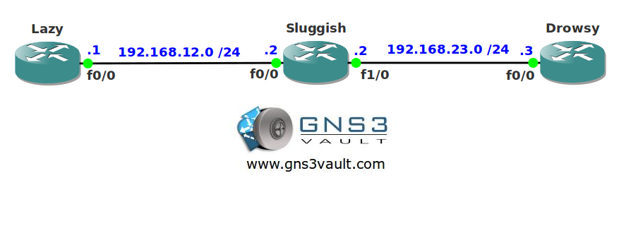

# Network Based Application Recognization (NBAR)

## Scenario

As the owner of a small company you notice some of your employees are slacking off at the job and spending their time at Facebook, Twitter and some other sites. You want to configure your network so these sites are blocked. While you are at it you also want to block some of the worms that are on the Internet.

## Goal

- All IP addresses have been preconfigured for you.
- OSPF has been preconfigure for full connectivity.
- Configure router Sluggish so all traffic from Twitter is dropped on the FastEthernet 1/0 interface.
- Configure router Sluggish so it can detect the NIMDA worm and drops the traffic on the FastEthernet 1/0 interface.
- Configure router Sluggish so it marks Youtube traffic down to DSCP 0 on the FastEthernet 1/0 interface.

## IOS

c3640-jk9s-mz.124-16.bin

## Topology

## Video Solution

[YouTube Video](http://www.youtube.com/watch?v=JXHtctRgcSg)
