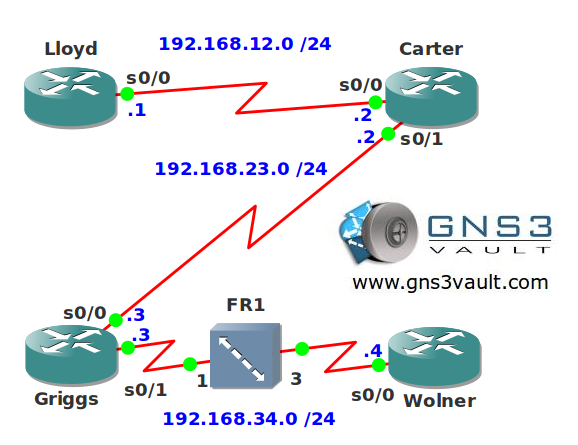

# Payload Compression Serial Links

## Scenario

You are the owner of a small ISP company located in The Netherlands. Most of the equipment you have running is fairly old and you have multiple different serial links in use. Bandwidth is an issue and since you don't have the budget to replace any links you are looking for a cheaper solution...think you can compress things?

## Goal

- All IP addresses have been preconfigured for you.
- Configure PPP encapsulation between router Lloyd and Carter.
- Configure HDLC encapsulation between router Carter and Griggs.
- Configure frame-relay encapsulation between router Griggs and Wolner.
- Configure LZS compression on the PPP link.
- Configure STACKER compression on the HDLC link.
- Configure packet-by-packet compression on the frame-relay link.

## IOS

- c3640-jk9s-mz.124-16.bin

## Topology

## Video Solution

[Payload Compression Serial Links Solution](http://www.youtube.com/watch?v=jwbp-Emjw_I)
