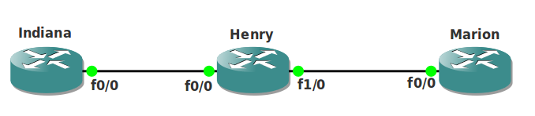

# QoS Hold-Queue and TX-Ring

## Scenario

As a famous adventurer you are well known for your discoveries. Every time you make an archaeological treasure you send the acquired information to your father's router. His router is an older model and has problems keeping up with the incoming data. Let's see if your networking adventures are just as fun...

## Goal

* All IP addresses have been preconfigured for you.
* OSPF has been configured to ensure full reachibility.
* Configure router Henry's input software queue to 12 packets on fastethernet 0/0.
* Configure router Henry's output software queue to 24 packets on fastethernet 1/0.
* Configure router Henry's hardware queue to be 20 packets.
* Use the `show interfaces fastethernet 0/0 | include queue` command to check your configuration.
* Optional: test your configuration by using the ping command, `ping 192.168.23.3 repeat 99999 timeout 0 size 1500` from router Indiana. You can see the queue fill up on router Henry.

## IOS

c3640-jk9o3s-mz.124-16.bin

## Topology

## Video Solution

http://www.youtube.com/watch?v=jBq7HX1c2Qo
