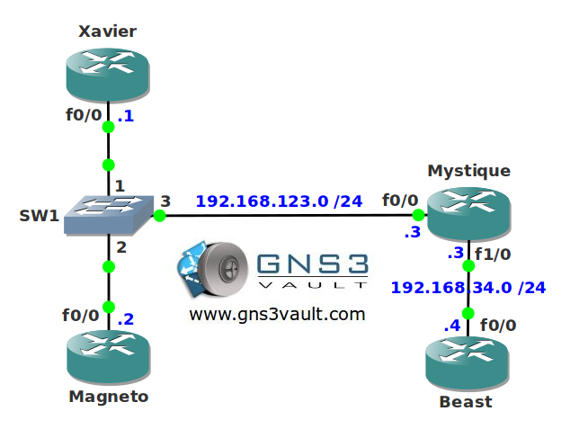

# RSVP Subnetwork Bandwidth Manager (SBM)

## Scenario

You are one of the member of a underground organization with special abilities. Your ability is being able to take the form of an IP packet and work your way through the network with your mind. You want to ensure some of the traffic streams are able to make a reservation in the network to ensure there is enough bandwidth.

## Goal

* All IP addresses have been preconfigured for you.
* OSPF has been preconfigure for full connectivity.
* Configure the link between router Mystique and Beast with a bandwidth of 256Kbps.
* Enable RSVP on all interfaces in the network. Ensure RSVP can use the highest bandwidth on the link between router Mystique and Beast but a single flow should have a maximum of 96Kbps.
* Configure router Magneto as the Designated Subnetwork Bandwidth Manager.
* Configure 512KBps for RSVP flows for network 192.168.123.0 /24.
* Configure router Magneto so it tells router Xavier and Mystique not to send more than 70Kbyte/sec for non-RSVP traffic.
* You can test your configuration by making reservations from router Xavier and Magneto.

## IOS

c3640-jk9s-mz.124-16.bin

## Topology

