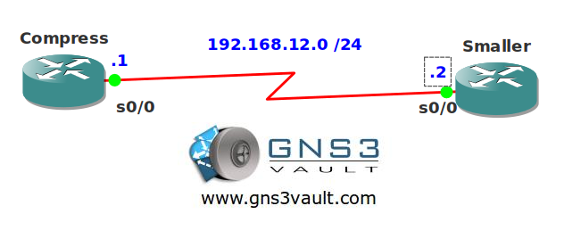

# TCP and RTP Header Compression

## Scenario

You are responsible for the WAN links at the company you work for. Your routers have a very low CPU load and the serial interfaces you have are pretty slow. You decide one day to run TCP and UDP header compression to get the most out of your connections...let's squeeze some bits!

## Goal

- All IP addresses have been preconfigured for you.
- Enable TCP and RTP header compression on both routers.
- Configure a maximum of 12 compressed TCP or RTP sessions.
- Router Smaller should only use compression when it receives compressed traffic.

## IOS

c3640-jk9s-mz.124-16.bin

## Topology

## Video Solution

http://www.youtube.com/watch?v=2D47Pu_SueU
