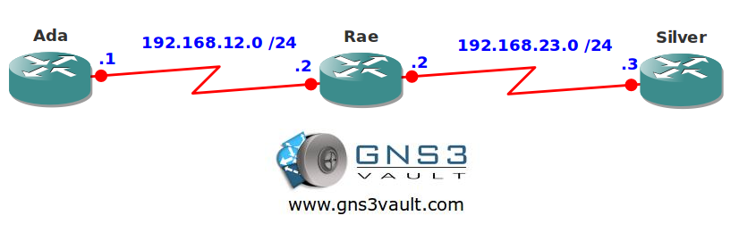

# WFQ Weighted Fair Queueing

## Scenario

Ada and Silver are using the network for a range of applications like FTP, HTTP, TELNET and more. Recently there have been some complaints about slow network performance and it's up to you to make sure each application gets a fair share of the bandwidth.

## Goal

- All IP addresses have been preconfigured for you.
- EIGRP has been configured for full connectivity.
- Configure the S0/1 interface of router Rae with a bandwidth of 64kbps.
- Configure WFQ on the S0/1 interface of router Rae. The output hold-queue size should be 128, length of 16 for congestive discard threshold, a maximum of 128 conversations and 4 queues for RSVP.
- Configure the hardware queue on router Rae so WFQ will be activated as soon as possible.

## IOS

c3640-jk9s-mz.124-16.bin

## Topology

## Video Solution

[WFQ Weighted Fair Queueing Video Solution](http://www.youtube.com/watch?v=tzXj-Ik3Iow)
