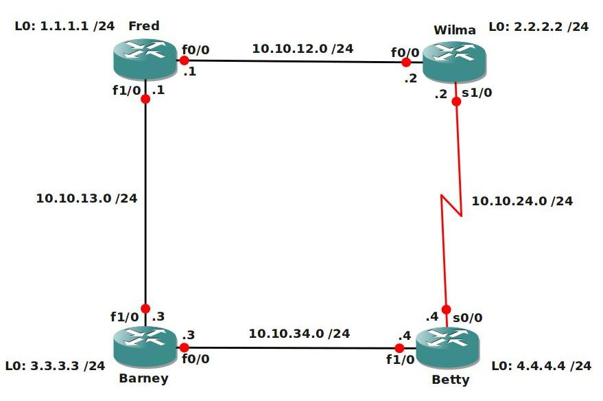

# RIP Advanced

## Scenario

You are a freelance network engineer and one of your customers has an old network based on the RIP routing protocol. This network needs some tuning so it's time to use some more advanced RIP tricks.

## Goal

- All IP addresses are preconfigured as specified in the topology picture.
- Configure RIP version 2 on all routers, make sure it does no summarization by itself.
- Advertise all networks in RIP, including the loopback interfaces. Achieve full connectivity.
- After using a debug on Router Fred, you notice that RIP is sending updates towards the loopback interfaces. Disable this.
- The link between Router Wilma and Betty is not allowed to send RIP traffic by using broadcast or multicast.
- When you start a ping from Router Wilma to 4.4.4.4 you notice the traffic is being sent down the slow serial-link, change the RIP configuration on Router Betty so the Fast Ethernet links will be used. You are not allowed to shutdown the serial link.
- Create a new loopback10 interface on router Betty, use IP address 44.44.44.44 /24
- Change the configuration on Router Fred so pings to 44.44.44.44 will be sent only through the serial link, not through the link towards Barney.
- Change the configuration on Router Wilma and Betty so only triggered updates are sent on the serial link.
- Configure Router Wilma so RIP V1 updates are sent towards Fred. You are not allowed to change the RIP version on Fred.
- Configure authentication between Router Barney and Betty:
  - key-chain: VAULT
  - key-id: 1
  - key-string: FREE
- Create 4 loopback interfaces on router Betty:
  - Loopback1: 172.16.0.1 /24
  - Loopback2: 172.16.1.1 /24
  - Loopback3: 172.16.2.1 /24
  - Loopback4: 172.16.3.1 /24
- Configure a summary on Router Barney so Router Fred will have a 172.16.0.0/22 entry in its routing table.

## IOS

- c3640-jk9s-mz.124-16.bin

## Topology

## Video Solution

[RIP Advanced Video Solution](http://www.youtube.com/watch?v=17s2_1rpSSM)
