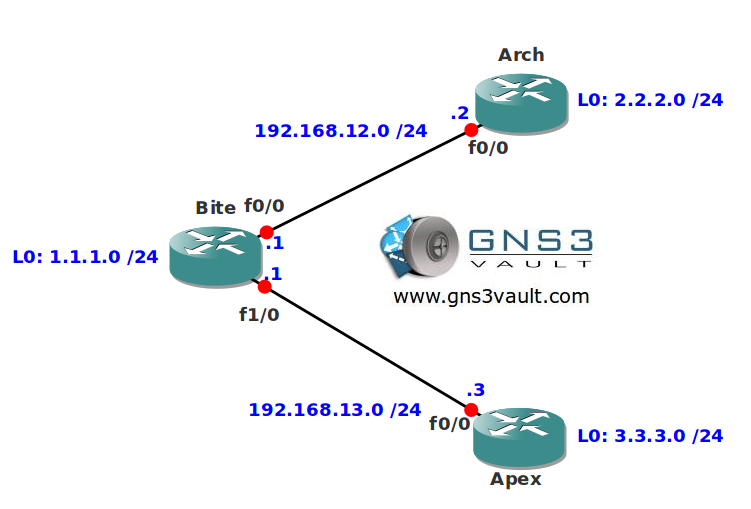

# RIP Authentication

## Scenario

Your local dentist just checked your teeth and has some bad news for you. He mentions he has some trouble with the dentist network running RIP and authentication. If you don't fix his RIP network he will perform root canal surgery on you so it's time to get going!

## Goal

- All IP addresses have been preconfigured for you.
- All routers have a loopback interface as following:
  - Bite: 1.1.1.1/24
  - Arch: 2.2.2.2/24
  - Apex: 3.3.3.3/24
- Configure RIP version 2 on all routers, achieve full connectivity for all networks (including the loopbacks)
- Configure RIP plaintext authentication between router Bite and Arch.
- Configure RIP MD5 authentication between router Bite and Apex.

## IOS

c3640-jk9s-mz.124-16.bin

## Topology

## Video Solution

http://www.youtube.com/watch?v=g8MmoNP9rt0
