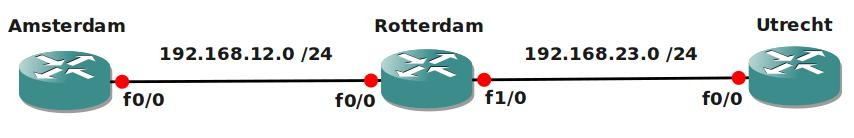

# RIP Beginner

## Scenario

You are working for a company located in the Netherlands. Your manager is the nostalgic kind of guy and wants you to configure the RIP Routing protocol on all of their routers. You try to convince him to run OSPF or EIGRP because of faster convergence, but to no avail....time to get the job done.

## Goal

- All IP addresses have been preconfigured for you.
- All routers have a loopback interface as following:
  - Amsterdam: 1.1.1.1/24
  - Rotterdam: 2.2.2.2/24
  - Utrecht: 3.3.3.3/24
- Configure RIP version 1 on all routers, achieve full connectivity for all networks (including the loopbacks)
- Utrecht: configure RIP version 2
- Utrecht: make sure you accept version 1 and 2 routing updates.
- All Routers: make sure you are only running version 2
- Change the configuration on all routers so the subnetmask is sent along with the routing updates.
- Amsterdam: make sure no routing updates are sent to the loopback interface.
- All routers: Change the RIP timers so routing updates happen every 10 seconds.
- Utrecht: Advertise a default route into RIP.

## Additional Information

## IOS

- c3640-jk9s-mz.124-16.bin

## Topology

## Video Solution

[Video Solution on YouTube](http://www.youtube.com/watch?v=AgTn1XI6A30)
