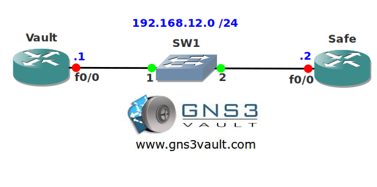

# RIP Broadcast

## Scenario

A small company selling physical security solutions has asked for your help with their network. They own two routers running RIP and it seems the switch in the middle is running amok when it receives multicast traffic. The company doesn't have any budget so they ask you to solve the problem without replacing the switch.

## Goal

- All IP addresses have been preconfigured for you.
- Both routers have a loopback interface as following:
  - Vault: 1.1.1.1/24
  - Safe: 2.2.2.2/24
- Configure RIP version 2 on both routers, achieve full connectivity for all networks (including the loopbacks).
- You are not allowed to send RIP packets by multicast or unicast.

## IOS

c3640-jk9s-mz.124-16.bin

## Topology

## Video Solution

[Video Solution on YouTube](http://www.youtube.com/watch?v=xtuOUtQY2eA)
