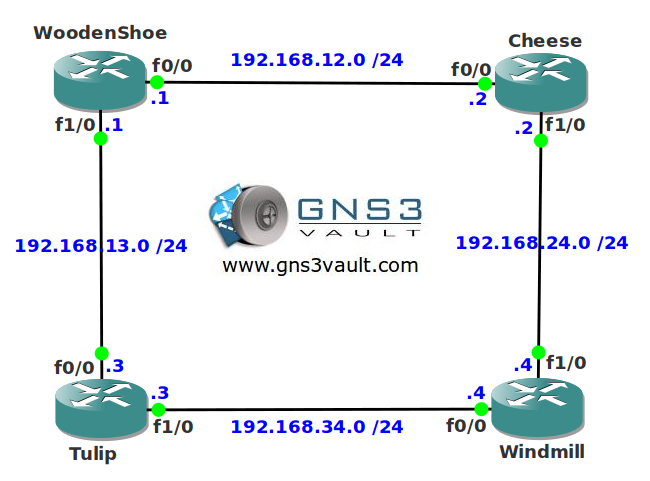

# RIP Filtering

## Scenario

You are the owner of a Dutch webshop selling Dutch export products. Recently there have been problems on the network, some users had access to certain parts of the network without authorization. You want to use a RIP solution to filter some of the networks. See if you can dutchify this network...

## Goal

- All IP addresses have been preconfigured for you.
- All routers have a loopback interface as following:
  - WoodenShoe: 1.1.1.1/24
  - Cheese: 2.2.2.2/24
  - Tulip: 3.3.3.3/24
  - Windmill: 4.4.4.4/24
- Configure RIP version 2 on all routers, achieve full connectivity for all networks (including the loopbacks).
- You notice router WoodenShoe is sending RIP updates to the loopback interface, you have to stop this.
- Create a prefix-list so router Cheese doesn't advertise its loopback0 interface to router Windmill.
- Create an access-list so router Tulip doesn't accept network 1.1.1.0/24.
- Create an offset-list so router Windmill doesn't accept network 3.3.3.0/24.
- Change the AD (Administrative Distance) so router WoodenShoe doesn't place network 2.2.2.0/24 in its routing table.

## IOS

c3640-jk9s-mz.124-16.bin

## Topology

## Video Solution

[View on YouTube](http://www.youtube.com/watch?v=YlTLPlqeRjY)
