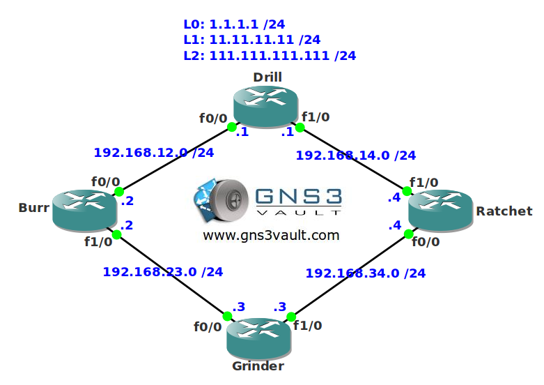

# RIP Offset List

## Scenario

You are a loyal customer of a company called "Ratchet Construction". They heard you are a famous network engineer and are looking for your help with their network. Their routers are running RIP and they would like to influence the routing paths currently in use. Since the routers are a couple of years old they don't support anything fancy like policy-based routing. See if you can grind your way through some RIP configurations...

## Goal

- All IP addresses have been preconfigured for you.
- Configure RIP version 2 on all routers and make sure you have full connectivity. Advertise all loopback interfaces on router Drill.
- You are only allowed to use offset-lists for this lab.
- Ensure router Burr, Ratchet and Grinder use the F1/0 link on router Drill to reach network 1.1.1.0 /24.
- Ensure router Ratchet uses the F0/0 link on router Drill to reach network 11.11.11.0 /24.
- Ensure network 111.111.111.0 /24 is unreachable for router Grinder. It has to be reachable for Burr and Ratchet.

## IOS

- c3640-jk9s-mz.124-16.bin

## Topology

## Video Solution

http://www.youtube.com/watch?v=epKKpwKXp7s
