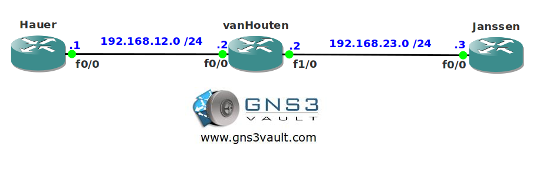

# RIP Send and Receive V1-V2

## Scenario:

A large international Movie company has decided all Dutch actors should have a private network for communications. Budgets are tight so you only have access to a couple of old routers that support RIP version 2 or 1. Can you configure this network to get things going?

## Goal:

- All IP addresses have been preconfigured for you.
- Every router has a loopback0 interface:
  - Hauer: 1.1.1.1 /24
  - vanHouten: 2.2.2.2 /24
  - Janssen: 3.3.3.3 /24
- Configure RIP version 2 on router Hauer.
- Configure RIP version 1 on router vanHouten.
- Configure RIP version 2 on router Janssen.
- Ensure you have full connectivity.

## IOS:

c3640-jk9s-mz.124-16.bin

## Topology:

## Video Solution:

http://www.youtube.com/watch?v=r0bKOFv17GQ
