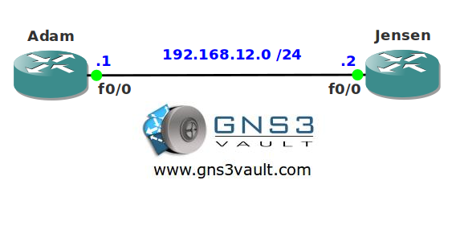

# RIP Source Validation

## Scenario

The year is 2027 and you are working as the network specialist for a museum in Asia. Your colleague has preconfigured a router with RIP before his vacation and it seems he made an error with the IP address. Unfortunately there is no way for you to access this router since it's located in Europe. You need to configure RIP so it accepts routing information without checking for the correct source IP address.

## Goal

* All IP addresses have been preconfigured for you.
* Both routers have a loopback interface as following:
  * Adam: 1.1.1.1/24
  * Jensen: 2.2.2.2/24
* Configure RIP version 2 on both routers, achieve full connectivity for all networks (including the loopbacks).
* You are not allowed to change the IP addresses on any router.

## IOS

c3640-jk9s-mz.124-16.bin

## Topology

## Video Solution

[Video Solution on YouTube](http://www.youtube.com/watch?v=fFALTO8x3IQ)
