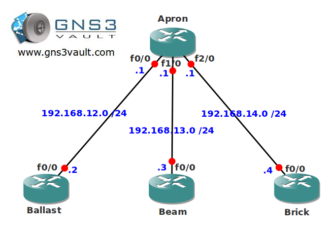

# RIP Summarization

## Scenario

Your are a construction worker for a company called "Apron Construction". You are looking for a method so your colleagues can easily send you information about construction parts they need. You grab a couple of older routers running RIP but they are running out of memory. You'll have to create some summaries to decrease the size of your routing tables and thus save some memory. Think you can DIY?

## Goal

- All IP addresses have been preconfigured for you.
- Configure RIP version 2 on all routers and make sure you have full connectivity.
- Create a summary on router Ballast so all networks on the loopback interfaces are advertised as one optimal route.
- Create four summaries for the loopback interfaces on router Beam without having overlapping networks.
- Create one summary on router Brick so all networks on the loopback interfaces are advertises as one optimal route.

## IOS

c3640-jk9s-mz.124-16.bin

## Topology

## Video Solution

http://www.youtube.com/watch?v=jgDqE1oq5xA
