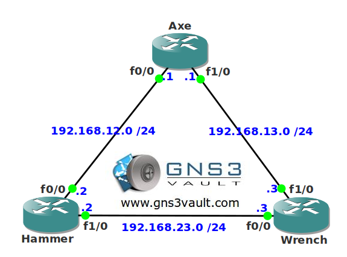

# RIP Timers

## Scenario

"Tools Inc" is a small shop selling second-hand tools to network engineers. You are one of their customers and after buying a nice Axe they ask you for their help with their RIP network. The convergence time seems to be a bit slow and they ask you if it's possible to tune it. Can you drop the hammer on this one?

## Goal

- All IP addresses have been preconfigured for you.
- Configure RIP version 2 on all routers and make sure you have full connectivity.
- Tune the RIP timers so convergence is six times faster than the default.
- Your changes should not effect the link between router Hammer and Wrench.

## IOS

c3640-jk9s-mz.124-16.bin

## Topology

## Video Solution

http://www.youtube.com/watch?v=kfgyp6C-YBg
