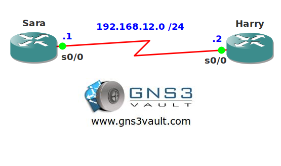

# RIP Triggered Updates

## Scenario

Harry and Sara are network consultants and studying for their CCIE R&S certification. They both have a router and they are running RIP on the serial link to exchange routing information. Their ISP charges them for each byte sent so they want to make sure RIP doesn't send any unnecessary traffic.

## Goal

- All IP addresses have been preconfigured for you.
- Both routers have a loopback interface as following:
  - Sara: 1.1.1.1/24
  - Harry: 2.2.2.2/24
  - Configure RIP version 1 on both routers, achieve full connectivity for all networks (including the loopbacks).
- Ensure RIP only sends updates when unnecessary.
- Sara and Harry would like to know how they can see this configuration is active without looking at the running- or startup-config. Can you help them?

## IOS

c3640-jk9s-mz.124-16.bin

## Topology

## Video Solution

http://www.youtube.com/watch?v=feVtPueT1AQ
