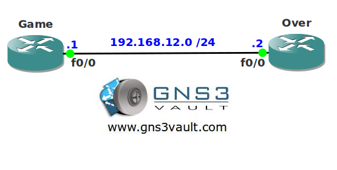

# RIP Unicast

## Scenario

You are the junior network engineer of a company selling Videogames. The company has a small network running RIP between their routers. It seems something is going wrong with RIP multicast traffic. Think you can solve this game?

## Goal

- All IP addresses have been preconfigured for you.
- Both routers have a loopback interface as following:
  - Game: 1.1.1.1/24
  - Over: 2.2.2.2/24
- Configure RIP version 2 on both routers, achieve full connectivity for all networks (including the loopbacks).
- You are not allowed to send RIP packets by multicast or broadcast.

## IOS

c3640-jk9s-mz.124-16.bin

## Topology

## Video Solution

http://www.youtube.com/watch?v=-F5wyfVrx5g
