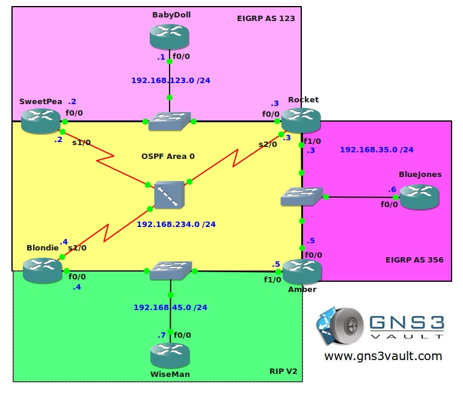

# Expert Redistribution

## Scenario:

You have been a network engineer as long as you can remember. Recently the company experienced a network failure and your colleagues have blamed you for misconfiguration of the routers. As a result you are taken to a mental institution and it seems your networking days are over...however during your sleep you are being plagued by nightmares about redistribution scenarios. Let's see if you can suckerpunch this one!

## Goal:

* All IP addresses have been preconfigured for you:
  * Loopback interface: L0: x.x.x.x /24, for example 1.1.1.1 for router 1
* EIGRP AS 123 has been preconfigured on router BabyDoll, SweetPea and Rocket
* OSPF Area 0 (Process 234) has been preconfigured on router SweetPea, Rocket and Blondie
* EIGRP AS 356 has been preconfigured on router Rocket, BlueJones and Amber
* RIP Version 2 has been preconfigured on router Blondie, Amber and WiseMan
* Router BabyDoll's loopback0 interface is advertised in EIGRP AS123
* Router SweetPea's, Blondie's and Rocket's loopback0 interfaces are advertised in OSPF Area 0
* Router Amber's and BlueJones's loopback0 interfaces are advertised in EIGRP AS356
* Router WiseMan's loopback0 interface is advertised in RIPV2
* Configure 2-way redistribution on router SweetPea and Rocket between EIGRP AS123 and OSPF
* Configure redistribution on router Rocket between EIGRP AS356 and OSPF
* Configure redistribution on router Blondie between RIPV2 and OSPF
* Ensure you have full connectivity at this moment, every network / loopback should be reachable from any device
* Remove the "network 1.0.0.0" command on router BabyDoll and replace it by redistributing the loopback0 interface into EIGRP AS123
* Do a traceroute from router SweetPea and Rocket to 1.1.1.1, you notice packets are sent through the OSPF network. Ensure they take the most optimal route to the destination
* Ensure all traffic will be sent using the FastEthernet links. The Frame-Relay links should only be used as a backup when the FastEthernet links are down

## IOS:

c3640-jk9o3s-mz.124-16.bin

## Topology:
