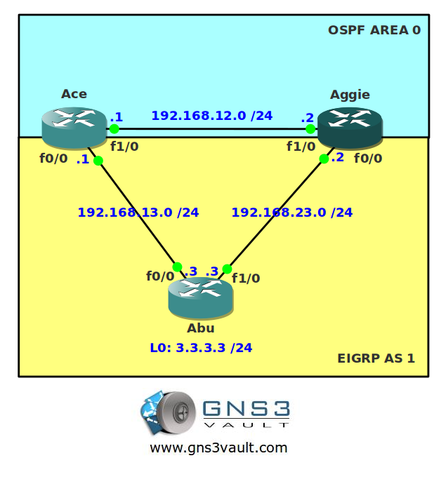

# One-Way Redistribution

## Scenario

Your local neighborhood pet shop has asked you to help them solve some network problems. The pet shop is running OSPF and recently bought another shop that is running EIGRP. To achieve connectivity they use redistribution but now some users are complaining about the slow network speed. Up to you to fix some problems!

## Goal

- All IP addresses have been preconfigured for you.
- Configure OSPF on router Ace and Aggie and only advertise network 192.168.12.0 /24.
- Configure EIGRP AS 1 on router Ace, Aggie and Abu. Only advertise network 192.168.13.0 /24 and 192.168.23.0 /24.
- Redistribute the loopback0 interface in EIGRP AS 1 on router Abu.
- Redistribute EIGRP information into OSPF on router Ace.
- Do a traceroute from router Aggi or Ace to network 3.3.3.0 /24. You notice that you are not using the most optimal path...fix this problem so router Aggie uses the most optimal path.

## IOS

c3640-jk9s-mz.124-16.bin

## Topology

## Video Solution

[http://www.youtube.com/watch?v=eNlSHZaK6Gc](http://www.youtube.com/watch?v=eNlSHZaK6Gc)
