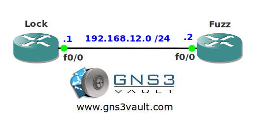

# AAA Command Authorization

## Scenario

As part of the security team you are always looking for ways to improve security within the company. You want to get rid of all the local vty/console logins within your network so you decide to implement some AAA security.

## Goal

- All IP addresses have been configured for you, look at the topology picture for the IP addresses.
- Configure OSPF on both routers.
- Create a user called "vault" with password "safe" and make sure this user can use OSPF debug commands.
- User "vault" should also be able to see the running-configuration.

## Topology

