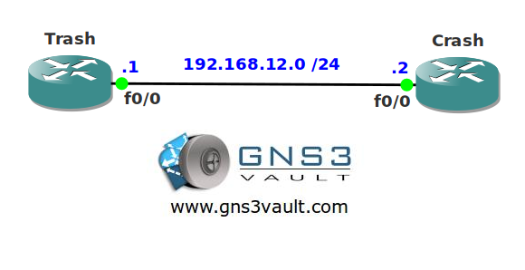

# ACL Selective IP Options Drop

## Scenario

You are the security office for the national security team in the Netherlands. One of your routers has a very high CPU load and after looking closely you can see it's spending a lot of cycles processing IP packets with special options. Since this isn't normal you decide to implement some filtering.

## Goals

- All IP addresses have been preconfigure for you.
- Configure router Trash so it drops IP packets with the timestamp option.
- Configure router Trash so it drops IP packets with the loose source option.

## IOS

c3725-adventerprisek9_ivs-mz.124-15.T13

## Topology

## Video Solution

[http://www.youtube.com/watch?v=DWCjzhNLLK4](http://www.youtube.com/watch?v=DWCjzhNLLK4)
