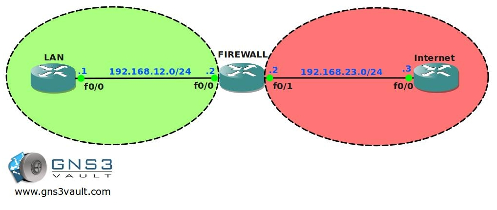

# Basic Zone Based Firewall

## Scenario

Being a full-time Cisco Network Engineer you decide to implement a new router at your home network. You heard good stories about Zone Based Firewalls so you decide to beef up your home security. Let's see what you can do...

## Goal

* All IP addresses have been configured for you, every router has a loopback interface:
  * Router LAN: L0: 1.1.1.1 /24
  * Router FIREWALL: L0: 2.2.2.2 /24
  * Router INTERNET: L0: 3.3.3.3 /24 and L1: 33.33.33.33 /24

* Static routes have been configured for you, there is full connectivity between the routers.

* Router INTERNET has the following services configured: SSH, TELNET, DNS, HTTP and HTTPS.

* Router FIREWALL has the following services configured: SSH and TELNET.

* Username: gns3vault

* Password: gns3vault

* Create 2 security zones called "LAN" and "INTERNET" on router FIREWALL.

* Place the corresponding interfaces into the correct zones.

* Create the correct class-map, policy-map and zone-pair so traffic from LAN to INTERNET is allowed, including the return traffic.

* Traffic from INTERNET to LAN should be blocked.

* Increase security by only allowing HTTP, ICMP and HTTPS traffic from LAN to INTERNET.

* Test this by using telnet from router LAN to router INTERNET, this should be blocked.

The security between your LAN and the INTERNET is looking good, but users from the LAN are still able to telnet or ssh into your Firewall. Even worse, people from the Internet can telnet or ssh into your firewall as well! Time to protect your firewall...

* Connections from the INTERNET should only be able to ping to router FIREWALL. Use "Zone Self" to achieve this.

* Users from the LAN should only be able to SSH into router FIREWALL, Telnet should be blocked. Use "Zone Self" to achieve this.

## IOS

c3725-adventerprisek9-mz.124-15.T7.bin

## Topology

## Video Solution

[YouTube Video Solution](http://www.youtube.com/watch?v=1LyBonrz9yc)
