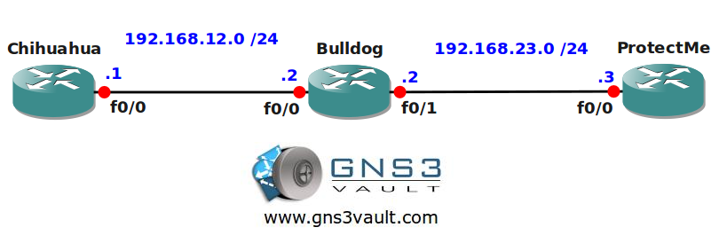

# Dynamic Access List - Lock and Key

## Scenario

You are the senior network engineer at a company called "The Router Whisperer". Your boss heard about a new feature to increase security for one of your customers who is a famous dog trainer. You need to make sure that users authenticate to router Bulldog before they are allowed access to router ProtectMe.

## Goal

- All IP addresses have been configured for you, look at the topology picture for the IP addresses.
- Static routes have been configured for you to ensure full connectivity.
- Configure router Bulldog so users have to authenticate before they are allowed telnet access into router ProtectMe.

## Topology

## Video Solution

[View on YouTube](http://www.youtube.com/watch?v=qCyvUIHh2jo)
