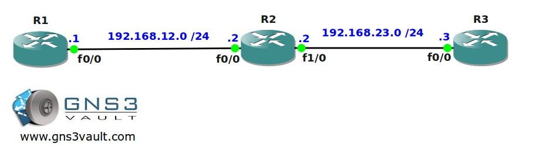

# IOS Firewall - CBAC

## Scenario

As the network engineer for your company you are responsible for all network-related tasks. One day your security officer comes to you and asks if you can further enhance the network security. He wants you to implement an IOS Firewall feature to protect incoming traffic.

## Goal

- All IP addresses have been configured for you.
- Router Mainframe is configured as a webserver, telnet is enabled as well.
- You are not allowed to remove the access-list on the F1/0 interface of router FW.
- Traffic originated from Mainframe is not allowed to reach router Host.
- Router host should be able to telnet into router mainframe.

## IOS

`c3640-jk9o3s-mz.124-16.bin`

## Topology

## Video Solution

[Video: IOS Firewall CBAC Configuration](http://www.youtube.com/watch?v=AAw81cf5IBE)
